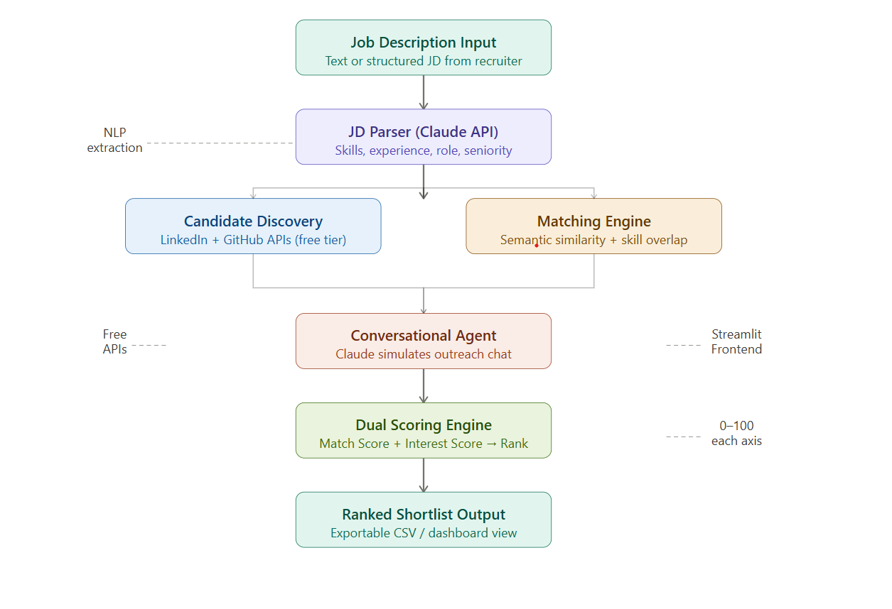

# 🎯 TalentScout AI — AI-Powered Talent Scouting & Engagement Agent

> Paste a Job Description → Get a ranked, engagement-scored candidate shortlist in minutes.

---

## 📌 Overview

TalentScout AI is an end-to-end AI agent built for recruiters. It takes a raw Job Description as input, discovers matching candidates, simulates conversational outreach to assess genuine interest, and produces a ranked shortlist scored on two dimensions: **Match Score** and **Interest Score**.

Recruiters no longer need to manually sift through profiles or chase candidate interest — the agent handles everything and delivers an immediately actionable shortlist.

---

## 🚀 Working Prototype

> 🌐 [Live App on Streamlit Cloud](https://talent-scout-agent-etdie8fg8rc4uenld4tt4i.streamlit.app) 
---

## 🏗️ Architecture Diagram



---

## 🔍 Architecture Description

The agent is built as a **5-stage sequential pipeline**:

### Stage 1 — JD Parser
The recruiter pastes a raw job description into the UI. The **Anthropic Claude API** reads it and extracts fully structured data including:
- Job title and seniority level
- Required skills and nice-to-have skills
- Minimum years of experience
- Industry category
- A 2-sentence role summary used for semantic matching

### Stage 2 — Candidate Discovery
The agent loads candidates from a **mock database of 20 diverse profiles** simulating a real talent pool. Each candidate profile is optionally enriched with live data from the **GitHub REST API** (public repos, followers, bio) using the free tier. Candidates are pre-filtered by a minimum experience threshold before proceeding to scoring.

### Stage 3 — Matching Engine
Every candidate is scored against the parsed JD using three signals combined into a **Match Score (0–100)**:

| Component | Weight | Method |
|-----------|--------|--------|
| Skill Overlap | 50% | Exact keyword match of required skills vs candidate skills |
| Semantic Similarity | 30% | Sentence-BERT cosine similarity between JD summary and candidate bio |
| Experience Fit | 20% | Smooth scoring that penalises under-qualification and slightly penalises over-qualification |

The semantic similarity uses the `all-MiniLM-L6-v2` model from `sentence-transformers` which runs **100% locally** — no API call needed. This catches conceptual alignment even when exact keywords differ.

### Stage 4 — Conversational Outreach Agent
For each candidate, the **Anthropic Claude API** simulates a 2-turn recruiter conversation. Claude plays the role of the candidate and responds authentically based on their availability status and professional background. This produces natural language responses that are then scanned for interest signals.

The conversation covers:
- **Turn 1:** Recruiter introduces the role and asks for a chat
- **Turn 2:** Recruiter asks what kind of role would excite them and what matters most in their next move

### Stage 5 — Dual Scoring & Ranking
Every candidate receives two final scores:

**Match Score (0–100):** How well their profile fits the JD technically
**Interest Score (0–100):** How genuinely interested they appear based on availability + conversation sentiment

```
Final Combined Score = (Match Score × 0.60) + (Interest Score × 0.40)
```

The output is a **sorted shortlist table**, a **Match vs Interest scatter plot**, full **conversation transcripts**, and a **downloadable CSV** — ready for the recruiter to act on immediately.

---

## 📊 Scoring Logic in Detail

### Match Score Breakdown

```
Match Score = (Skill Overlap × 0.50) + (Semantic Similarity × 0.30) + (Experience Fit × 0.20)
```

- **Skill Overlap:** Counts how many of the JD's required skills appear in the candidate's skill list. Result expressed as a percentage.
- **Semantic Similarity:** Converts both the JD role summary and candidate bio into dense vector embeddings using Sentence-BERT and computes cosine similarity. Score range 0–1, scaled to 0–100.
- **Experience Fit:** Candidates with fewer years than required score proportionally lower. Candidates within 4 years over the requirement score 1.0. Highly over-qualified candidates score 0.5 minimum to flag potential retention risk.

### Interest Score Breakdown

| Signal | Score Impact |
|--------|-------------|
| Availability: actively_looking | Base score: 65 |
| Availability: open_to_opportunities | Base score: 50 |
| Availability: not_looking | Base score: 25 |
| Positive keywords detected in conversation | +8 per keyword |
| Neutral/curious keywords detected | +3 per keyword |
| Negative keywords detected | -10 per keyword |

**Positive keywords tracked:** excited, definitely, love to, great opportunity, sounds perfect, when can we, very interested, yes absolutely, looking forward

**Negative keywords tracked:** not really, happy where I am, not looking, too busy, not interested, pass, not the right fit

---

## 🛠️ Tech Stack

| Layer | Technology |
|-------|-----------|
| LLM (JD Parsing + Outreach) | Anthropic Claude (claude-haiku-4-5) |
| Semantic Matching | sentence-transformers — all-MiniLM-L6-v2 (local) |
| Candidate Enrichment | GitHub REST API |
| Frontend + UI | Streamlit |
| Data Handling | Pandas |
| Visualisation | Plotly |
| Deployment | Streamlit Community Cloud |

---

## 💳 APIs Used & Cost

| API / Tool | Free? | Details |
|------------|-------|---------|
| Anthropic Claude API | Low-cost | ~$0.014 per full run (5 candidates) |
| GitHub REST API | ✅ Free | 5,000 requests/hour with token |
| sentence-transformers | ✅ Free | Runs 100% locally, no API key needed |
| Streamlit Community Cloud | ✅ Free | Free deployment with public URL |

> **Note on Anthropic API cost:**
> We use **Claude Haiku** (claude-haiku-4-5) which is Anthropic's fastest and most affordable model.
> - Input: $0.80 per million tokens
> - Output: $2.40 per million tokens
> - **Cost per full demo run (5 candidates): ~$0.014 (less than 2 paise)**
> - **$5 in credits = approximately 350 full runs**
>
> New Anthropic accounts receive free trial credits sufficient to run the project
> multiple times before any payment is needed. The choice of Claude Haiku over
> larger models keeps costs minimal while maintaining high quality output.

---

## ⚙️ Local Setup Instructions

### Prerequisites
- Python 3.9 or higher
- Anthropic API key — sign up at https://console.anthropic.com
- GitHub Personal Access Token — create at https://github.com/settings/tokens

### Step 1 — Clone the Repository
```bash
git clone https://github.com/YOUR_USERNAME/talent-scout-agent
cd talent-scout-agent
```

### Step 2 — Create Virtual Environment
```bash
python -m venv venv

# Mac/Linux:
source venv/bin/activate

# Windows:
venv\Scripts\activate
```

### Step 3 — Install Dependencies
```bash
pip install -r requirements.txt
```

### Step 4 — Configure API Keys
Create a `.env` file in the project root:
```
ANTHROPIC_API_KEY=sk-ant-your-key-here
GITHUB_TOKEN=ghp_your-token-here
```

### Step 5 — Run the App
```bash
streamlit run app.py
```

The app will open automatically at `http://localhost:8501`

---

## 📁 Project Structure

```
talent-scout-agent/
├── app.py                        ← Streamlit frontend (main entry point)
├── architecture.png              ← Architecture diagram
├── requirements.txt
├── README.md
├── .env                          ← API keys (not committed to git)
├── .gitignore
├── agents/
│   ├── __init__.py
│   ├── jd_parser.py              ← Parses JD using Claude API
│   ├── candidate_discovery.py    ← Loads candidates + GitHub enrichment
│   ├── matching_engine.py        ← Semantic matching + Match Score
│   ├── outreach_agent.py         ← Conversational simulation + Interest Score
│   └── scorer.py                 ← Final dual scoring and ranking
├── data/
│   └── mock_candidates.json      ← 20 synthetic candidate profiles
├── samples/
│   ├── sample_input_1.txt        ← Sample JD: Python Backend Engineer
│   ├── sample_input_2.txt        ← Sample JD: ML Engineer
│   └── sample_output.md          ← Sample ranked shortlist output
└── utils/
    ├── __init__.py
    └── helpers.py
```

---

## 📥 Sample Input

**Sample JD — Senior Backend Engineer:**
```
We are looking for a Senior Backend Engineer with 4+ years of experience in Python,
FastAPI, and PostgreSQL. You will build scalable microservices on AWS, write clean APIs,
and mentor junior engineers. Experience with Docker and Kubernetes is a plus.
We are a Series B fintech startup based in Bengaluru.
```

---

## 📤 Sample Output

| Rank | Name | Title | Match Score | Interest Score | Combined Score |
|------|------|-------|-------------|----------------|----------------|
| 1 | Priya Sharma | Senior Software Engineer | 82.1 | 76.0 | 79.9 |
| 2 | Vikram Nair | Full Stack Developer | 74.3 | 81.0 | 77.0 |
| 3 | Sneha Kulkarni | Full Stack Engineer | 71.2 | 89.0 | 78.5 |
| 4 | Nikhil Desai | Backend Engineer (Go) | 65.4 | 75.0 | 69.2 |
| 5 | Rohan Verma | Backend Engineer | 60.1 | 50.0 | 56.1 |

> Full conversation transcripts and CSV export available in the live app.

---

## 🔒 Security Notes

- API keys are stored in `.env` file which is listed in `.gitignore`
- Never commit your `.env` file to GitHub
- For Streamlit Cloud deployment, add keys via the Secrets Manager in the dashboard

---

## 👤 Author

Built for the AI Talent Scouting & Engagement Agent hackathon submission.

---

## 📄 License

MIT License — free to use, modify, and distribute.